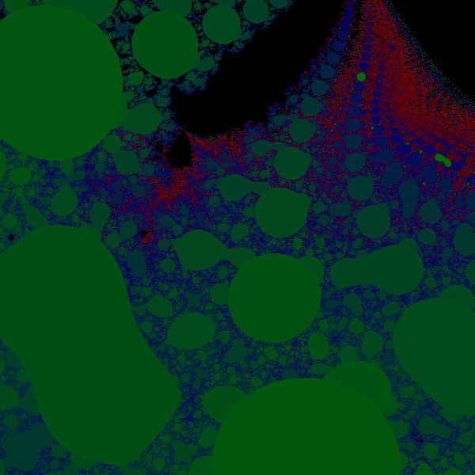
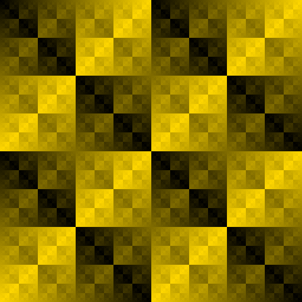
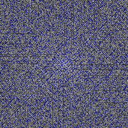

# Math Games
These are some mathematical games that I wrote. Most of them I invented myself.

## Fractals

`fractals.py` supports a bunch of different fractal generated algorithms and colour palettes. It makes pictures like this:

`./fractals.py mandelbrot images/mandelbrot --center="-0.11378702859237537+0.8826781799120236j" --zoom 1048576 --tries 10000 --size 600`


`./fractals.py magnet2 magnet2 --size 600 --palette "darkgreen" --center="0.347-0.189583j" --zoom 32 --tries 200`




When an image is complete (i.e. it's not currently running something), you can:
* Left mouse click to recentre on a point and zoom in by a factor of 2.
* s to save the image. It will be saved as `filename{centerCoordinates}x{zoom}.png` to avoid collisions.
* b to add bump mapping to the image to create an illusion of 3D texture.

## Maths Pictures

`mathspictures.py` can create mathematical images like these:

### XOR

`./mathsPictures.py xor xor.png --foreground 'gold' --size 511`



`./mathsPictures.py ulam ulam.png --foreground 'skyblue' --background 'blue'`

### Ulam spirals



`/mathsPictures.py ulam ulamdark.png --foreground 'blue' --background 'black'`


## Geek of All Trades


`geek.py` is a mathematical-linguistic game I invented called Geek of All Trades. First you are told what type of math problem you are going to do. Based on that, you decide how many digits you want to work with, which determines the difficulty level. If one digit numbers are chosen, most grade school children should be able to solve the problems. Adults may need to choose more digits to keep this part of the game entertaining. After you type the number in, you're given a secret code to translate the numbers into letters, and you should make the longest word that you can out of these letters in order. The game can verify that you made a correct word in 12 languages. If you make a word in an unsupported language, it will ask you to score it yourself on the honour system.

Sample play:

```
How many digit numbers do you want to work with to solve math.factorial(x)? 1
Solve math.factorial(9) : 362880
That's right! Now turn the numbers into letters into a word. 
2 for length 6
Select a language: de, ελ, en, es, fi, it, hu, мк, pl, ro, sk, sr, or other: hu
Enter a word that matches the digits in your answer, or the starting digits.
The digits must be in order: masnivá
Points for m
Points for s
Points for n
Points for v
Progress: 3 of 5
```

## Number Rules
`numberules.py` is a fun twist on "guess the number". Instead of guessing a number, you're given 3 numbers from a sequence of numbers and you have to try to guess the sequence. If you supply 5 numbers from the hidden sequences before you guess 10 numbers that are not in the sequence, you win. This is a fair ratio, because some of the sequences are quite difficult and there are a lot of possibilities.

Sample play:

Start with three numbers:
```
Guesses remaining:  10
Correct answers:  0
Included: [512, 5832, 64]
```

After guessing a few wrong numbers, `16` and `25`, and a few right numbers like `1` and `8`, I figured it was probably perfect cubes and filled in some more numbers:

```
Guesses remaining:  8
Correct answers:  4
Included: [512, 5832, 64, 1, 8, 125, 216]
Excluded: [16, 25]
Guess a number that matches these numbers: 729
You win!
Rule: Perfect cubes are numbers that are multiplied by themselves three times, like
5×5×5 = 125
Do you want to play again? Y/n 
```

## Typing Games
`typing.py` is a simple typing test. It has two modes. 

### Own text mode
In Own text mode, you can type whatever you want and it will tell you:
* How many characters you typed
* In how many seconds
* Your typing speed in CPM (characters per minute)
* Your typing speed in WPM (words per minute), which is [defined at 5 characters/word](https://en.wikipedia.org/wiki/Words_per_minute).

### Fortune mode
In Fortune mode, you are given a short fortune to type, from the unix program `fortune -s`. This is a port of the game `typefortune` which I used to play on Debian a long time ago but seems to be missing from Arch's respositories. In addition to the information from Own text mode, you will learn:
* How many errors you made
* What those errors were
* Your error rate percentage
* Your typing speed in ACPM (accurate characters per minute)
* Your typing speed in AWPM (accurate words per minute)

## Days
`days.py` is a game that teaches you how to calculate the day of the year. It gives you a random date, you enter what day of the week that was, and it keeps track of how many you get right. If you ask it for help, it will give you a formula to use for the calculation.


## Mastermind
`mastermind.py` is not my invention, I just coded it up. [Mastermind](https://en.wikipedia.org/wiki/Mastermind_(board_game)) is a famous board game. The computer thinks of an n-digit number, which you must guess. After each guess, the computer tells you how many digits were correct and how many were in the right position.

